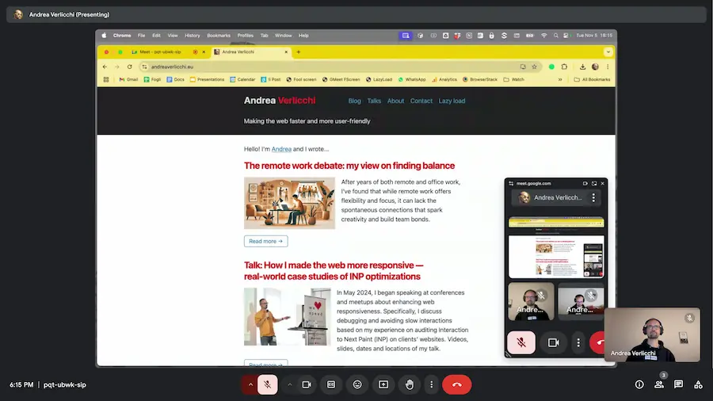
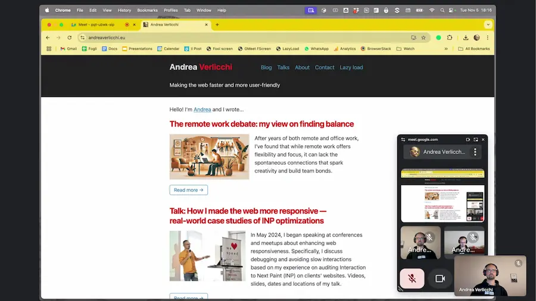

# Google Meet _true_ Full Screen

## What this is

**A bookmarklet for toggling real full screen on Google Meet.**

Before 


After


## How to create your bookmarklet

Copy the following code:

```js
const jsCtrlId = 'hVZhab'; for (const controller of document.querySelectorAll(`[jscontroller="${jsCtrlId}"]`)) if (controller.style.display === '') controller.style.display = 'none'; else controller.style.display = '';
```

Open [Caio Rordrigues' Bookmarklet Maker](https://caiorss.github.io/bookmarklet-maker/) in a new tab.

In the bookmarklet maker:
- Give your bookmarklet a title. This is the text you will see in the bookmarks bar. Example: `GMeet Full`.
- Paste the code you copied before into the "Code" section.
- Click "Generate bookmarklet"
- Below, you will see `Bookmaklet:` followed by the title you chose, e.g. `GMeet Full`.
- Drag that bookmarklet in your bookmarks bar.

Now, you have a new bookmark with the title you chose, e.g. `GMeet Full`.

**During Google Meet calls, you can click on the bookmark to hide the top bar, the bottom bar, and the controls. Click it again to bring back everything.**
